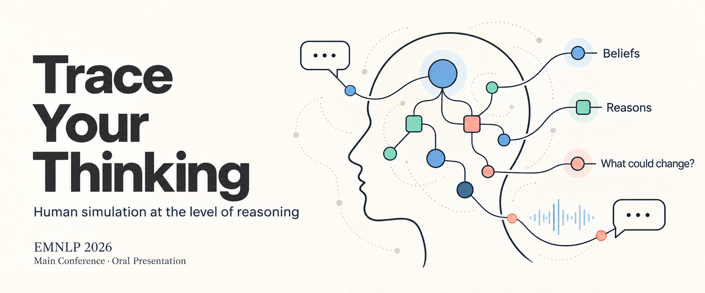
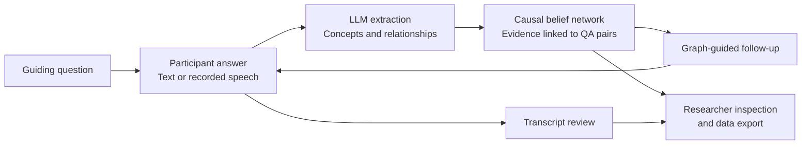

# Trace Your Thinking
### From Human Interviews to Human Simulation

**HugAgent · EMNLP 2026, main conference (oral)**

[Paper](https://arxiv.org/abs/2510.15144) · [HugAgent benchmark](https://github.com/jajamoa/HugAgent) · [Project page](https://jajamoa.github.io/HugAgent/) · [Interview website](https://trace-your-thinking.com) · [Quick start](#quick-start) · [Citation](#citation)



> From understanding a person to simulating how they think.

**Trace Your Thinking** is an open-source framework for **human simulation through semi-structured interviews**. It captures what a person believes, why they believe it, and how they weigh competing considerations. These interviews capture the individual reasoning behind their answers.

An AI interviewer follows up on each participant’s responses and maps the relationships between their beliefs. The resulting interviews support research on **digital twins, personalized agents, and how people would respond to situations they have never been asked about**.

The interview framework behind **[HugAgent](https://github.com/jajamoa/HugAgent)** (**EMNLP 2026 Oral**). See the companion repository for benchmark data and model evaluation.

## Research workflow

The interview develops around each participant’s answers, using an evolving belief graph to guide the next question.

1. **Elicit:** begin with researcher-authored guiding questions; participants respond by typing or recording speech.
2. **Extract:** use Qwen to identify concepts and perceived causal relationships from question–answer pairs.
3. **Build:** merge concepts into a participant-specific graph and retain links to the supporting interview evidence.
4. **Probe:** generate follow-ups about important concepts, upstream and downstream effects, relationship strength, and gaps in the graph.
5. **Review and export:** let participants review their transcript; let researchers inspect sessions and graphs and export collected data.



The graph represents **the participant’s expressed beliefs about causation**. Extracted relationships and confidence scores are model-derived representations, rather than independently established causal effects or participant-validated ground truth. HugAgent’s benchmark tasks and ground-truth construction are documented in the [companion repository](https://github.com/jajamoa/HugAgent).

## What is included

| Capability | Implementation |
| --- | --- |
| **Text and voice interviews** | Browser recording, English Whisper transcription after recording, and typed responses in [AnswerInput](components/AnswerInput.tsx). |
| **Adaptive follow-ups** | Graph-guided question templates for concept discovery, relationship construction and refinement, and motif-based graph completion in [question_generator.py](backend/question_generator.py). |
| **Evidence-linked belief graphs** | LLM extraction and concept merging, with QA provenance, confidence, importance, and signed relationship modifiers in [llm_extractor.py](backend/llm_extractor.py) and [cbn_manager.py](backend/cbn_manager.py). |
| **Session persistence and review** | Local browser state, MongoDB synchronization, and participant transcript editing in [lib/](lib/) and [review/](app/review/). |
| **Researcher workspace** | Guiding-question management, interview settings, session inspection, graph visualization, and bulk JSON exports in [components/admin/](components/admin/). |
| **Study protocols** | Seed scripts for **healthcare**, **surveillance**, and **zoning** in [scripts/](scripts/), plus participant IDs and an optional Prolific completion redirect. |

## Architecture

The application has **two services** and a MongoDB database.

| Layer | Stack | Role |
| --- | --- | --- |
| Interview interface | Next.js 15, React 19, TypeScript, Tailwind CSS, shadcn/ui, Zustand | Participant workflow and researcher dashboard |
| Application API | Next.js route handlers, Mongoose | Session persistence, graph storage, transcription, and Python API proxy |
| Reasoning backend | Python, Flask, DashScope/Qwen, NLTK | Concept extraction, CBN updates, and adaptive question generation |
| Storage | MongoDB | Sessions, guiding questions, settings, and causal graph snapshots |

The browser sends answers to `POST /api/process-answer`. The Next.js service loads the existing graph, forwards the request to the Python backend at `POST /api/process_answer`, and persists the returned graph. The Python backend currently initializes the extractor with **`qwen-turbo`**; speech transcription uses **`whisper-1`**.

```text
app/                      Participant pages, admin pages, and Next.js APIs
components/               Interview UI, transcript editor, and admin tools
lib/                      Client state, synchronization, and service clients
models/                   MongoDB models for sessions, questions, settings, graphs
backend/
  app.py                  Flask API and answer-processing orchestration
  llm_extractor.py        Qwen-based concept and relationship extraction
  cbn_manager.py          Belief graph updates and concept merging
  question_generator.py   Graph-guided follow-up generation
  schema.md               Causal belief network format
scripts/                  Guiding-question seed scripts
assets/                   Banner and supplementary SCM schema
```

The active Python service is `backend/`. The `backend.backup/` and `backup/` directories contain earlier implementations.

## Quick start

### 1. Install dependencies

Use Node.js 20+ with pnpm, Python 3.10+, a running MongoDB instance, and a DashScope API key. Voice input additionally requires an OpenAI API key and a browser with microphone access.

```bash
git clone https://github.com/jajamoa/trace-your-thinking.git
cd trace-your-thinking
pnpm install

python3 -m venv .venv
source .venv/bin/activate
python -m pip install -r backend/requirements.txt
```

On Windows, activate the environment with `.venv\Scripts\activate`.

### 2. Configure the services

Create `.env.local` in the repository root. Both Next.js and the active Python backend load this file.

```dotenv
MONGODB_URI=mongodb://127.0.0.1:27017/trace_your_thinking
DASHSCOPE_API_KEY=your_dashscope_api_key
OPENAI_API_KEY=your_openai_api_key
ADMIN_PASSWORD=choose_a_strong_admin_password

NEXT_PUBLIC_BASE_URL=http://localhost:3000
PYTHON_BACKEND_URL=http://127.0.0.1:5001
PORT=5001

NEXT_PUBLIC_RESEARCH_TOPIC=zoning
DEFAULT_TOPIC=zoning
MAX_QA_COUNT=50
DEBUG_LLM_IO=false
NEXT_PUBLIC_DEBUG_UI=false
```

**Set the backend URL explicitly:** `backend/app.py` defaults to port **5001**, while the Next.js proxy defaults to **5000** when `PYTHON_BACKEND_URL` is absent.

| Variable | Purpose |
| --- | --- |
| `MONGODB_URI` | Database connection for application data |
| `DASHSCOPE_API_KEY` | Qwen extraction in the Python backend |
| `OPENAI_API_KEY` | Whisper audio transcription; omit for text-only use |
| `ADMIN_PASSWORD` | Password for the researcher login at `/admin/login` |
| `PYTHON_BACKEND_URL`, `PORT` | Matching backend address and listening port |
| `NEXT_PUBLIC_BASE_URL` | Application base URL used by the logout redirect |
| `NEXT_PUBLIC_RESEARCH_TOPIC` | Landing-page and metadata topic configuration |
| `DEFAULT_TOPIC` | Python topic fallback when a request does not supply one |
| `MAX_QA_COUNT` | Backend question–answer count limit; default: 50 |
| `PROLIFIC_COMPLETION_URL` | Optional participant completion redirect |
| `DEBUG_LLM_IO`, `NEXT_PUBLIC_DEBUG_UI` | Optional LLM logging and landing-page debug display |

The `NEXT_PUBLIC_` variables are exposed to the browser. Keep API keys and database credentials in server-side variables.

### 3. Initialize a study protocol

The topic-specific seed scripts read their own environment files: `.env.zoning.local`, `.env.healthcare.local`, or `.env.surveillance.local`. For a local zoning study:

```bash
cp .env.local .env.zoning.local
node scripts/seed-guiding-questions-zoning.js
```

Use the corresponding script and environment filename for healthcare or surveillance. Each script seeds the same `guidingquestions` collection in its configured database and prompts before replacing existing questions. Use a separate database per study when maintaining multiple protocols.

### 4. Start both services

In one terminal, with the Python environment activated:

```bash
cd backend
python download_nltk_data.py
python app.py
```

In a second terminal, from the repository root:

```bash
pnpm dev
```

Open [localhost:3000](http://localhost:3000) for the interview flow, and [localhost:3000/admin/login](http://localhost:3000/admin/login) for researcher tools. Check backend availability at [localhost:5001/api/status](http://localhost:5001/api/status).

**Interview controls:** Space starts or stops recording in voice mode when a text field is not focused; Ctrl/Cmd+Enter submits a typed response; Escape cancels recording or clears text. Transcription runs after the recording stops.

## Data and API

**Interview sessions** store participant IDs, messages, QA pairs, progress, topic, and completion status. **Belief graphs** store concepts, directed relationships, extraction evidence, and QA history. See the [session model](models/Session.ts), [graph model](models/CausalGraph.ts), and [CBN schema](backend/schema.md). The [supplementary SCM schema](assets/data_schema.md) describes a richer representation and should not be assumed to match every runtime export.

| Next.js endpoint | Purpose |
| --- | --- |
| `POST /api/sessions` | Create an interview session |
| `GET /api/sessions/{id}` | Retrieve a session |
| `POST /api/process-answer` | Process an answer and obtain a graph and follow-ups |
| `GET /api/causal-graphs?sessionId=...` | Retrieve stored graph snapshots |
| `POST /api/questions` | Add a question to an existing session |
| `GET /api/questions?sessionId=...` | Retrieve session questions and pending questions |
| `GET /api/sessions/export?id=...&format=json` | Export a stored session as JSON |
| `GET /api/sessions/export?id=...&format=csv` | Export question–answer pairs as CSV |

Example: add a question to an existing session.

```bash
curl -X POST http://localhost:3000/api/questions \
  -H "Content-Type: application/json" \
  -d '{
    "sessionId": "YOUR_SESSION_ID",
    "question": {
      "text": "What evidence would change your view on this issue?",
      "shortText": "Conditions for belief change"
    }
  }'
```

The admin interface also exports session QA data and causal graphs in bulk as JSON. The singular `/api/session/export` and `/api/session/submit` routes contain mock implementations; use the database-backed plural `/api/sessions` routes for collected sessions.

## Adapting and deploying the framework

To adapt a study, edit the guiding-question protocol in [scripts/](scripts/) or the admin interface, align the study topic configuration, and adjust extraction prompts in [llm_extractor.py](backend/llm_extractor.py) and probing logic in [question_generator.py](backend/question_generator.py). The Qwen model is configured in [backend/app.py](backend/app.py).

For deployment, build the Next.js service with `pnpm build` and run it with `pnpm start`, or deploy it to a Next.js-compatible host. Host the Flask service separately and set `PYTHON_BACKEND_URL` to an address reachable from the Next.js server. Configure MongoDB and API credentials in the hosting environment; browser audio capture requires HTTPS outside localhost.

This is a research implementation. Before collecting participant data, review authentication and access controls on session and export endpoints, and review application logs, which can include interview content and authentication values. Configure consent, retention, and data access for your study.

## Citation

If you use this framework in research, please cite the associated HugAgent paper:

```bibtex
@inproceedings{li2026hugagent,
  title     = {HugAgent: A Human Simulation Benchmark for Individual-Level Reasoning},
  author    = {Li, Chance Jiajie and Mo, Zhenze and Tang, Yuhan and Qu, Ao and
               Wu, Jiayi and Zhao, Kaiya Ivy and Gan, Yulu and Fan, Jie and
               Yu, Jiangbo and Jiang, Hang and Liang, Paul Pu and Zhao, Jinhua and
               Alonso Pastor, Luis Alberto and Larson, Kent},
  booktitle = {Proceedings of the 2026 Conference on Empirical Methods in
               Natural Language Processing (EMNLP)},
  year      = {2026},
  note      = {Oral}
}
```

## License and contributions

Code is released under the [MIT License](LICENSE). HugAgent’s released participant data has separate terms documented in the [benchmark repository](https://github.com/jajamoa/HugAgent#licensing).

For questions, bug reports, or study-protocol contributions, open an [issue](https://github.com/jajamoa/trace-your-thinking/issues) or submit a pull request. Include the relevant service, configuration without secrets, and steps to reproduce.
